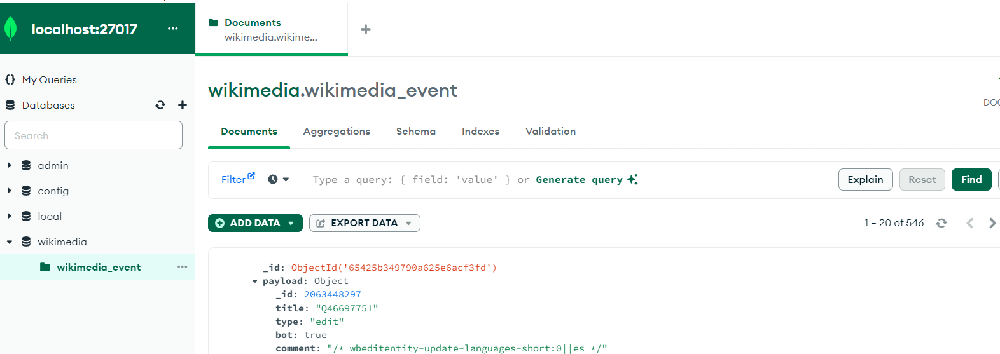

# wikimedia-springboot-kafka-mongo
Training project with Spring Boot,  Apache Kafka and MongoDB

# How to use
## Prerequisites
* Docker
* Docker-Compose
* Java 17
* MongoDB Compass

## Steps to run
1. `cd docker && docker-compose -p springboot-mongo-kafka up -d`
2. Run `wikimedia-connector` application [WikimediaConnectorApplication.java](wikimedia-connector%2Fsrc%2Fmain%2Fjava%2Fcom%2Fmy%2Ftutorial%2Fwikimediaconnector%2FWikimediaConnectorApplication.java)
3. Run `wikimedia-event-consumer` application [WikimediaEventConsumerApplication.java](wikimedia-event-consumer%2Fsrc%2Fmain%2Fjava%2Fcom%2Fmy%2Ftutorial%2Fwikimediaeventconsumer%2FWikimediaEventConsumerApplication.java)

## Check the results
1. Connect to the MongoDB server `http://localhost:27017`
2. In the list of the DB the `wikimedia` one should be present
3. The collection `wikimedia_event` should be present inside the `wikimedia` DB

4. Press `Find` button and the documents should be displayed
